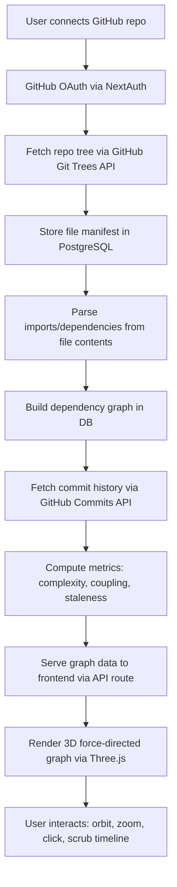

# Animus

> A real-time, interactive 3D graph that visualizes your codebase as a living nervous system — showing dependency flows, activity hotspots, and architectural decay as they happen.

## Overview

Codebases are growing faster than ever. AI-generated code, rapid iteration, and distributed teams mean that the software developers ship is increasingly opaque — even to the people who built it. Static analysis tools produce flat reports, dependency diagrams that nobody opens twice, and complexity scores buried in CI logs. None of these tools help a developer *feel* the shape and health of their codebase in real time.

**Animus** treats a codebase like a living organism. It ingests a GitHub repository and renders it as an interactive 3D force-directed graph — a neural network where files are neurons, imports are synapses, and activity is a heartbeat. Nodes pulse with recent commit activity, glow with complexity, and decay when neglected. Developers can navigate this living map to discover architectural patterns, identify coupling hotspots, trace dependency chains, and detect drift before it becomes technical debt.

The name *Animus* — Latin for "spirit," "soul," or "animating force" — captures the core idea: revealing the invisible life force that flows through every codebase. It's the soul your code always had but could never see.

## Name Rationale

**Animus** (Latin: *animus* — spirit, mind, life force) works on multiple levels:
- **Literal**: The tool *animates* a codebase — transforming static files into a living, breathing visualization
- **Conceptual**: It reveals the hidden *soul* of a project — the patterns, flows, and health that exist beneath the surface
- **Visual**: The 3D neural-network graph looks like a nervous system — the *animus* that makes an organism function
- **Memorable**: Short, punchy, domain-available, and doesn't read like a generic dev tool name

## Visual Direction (for `/branding`)

- **Symbol**: An abstract neural/synaptic network — glowing interconnected nodes forming a brain-like shape
- **Style**: Dark background, bioluminescent color palette (electric blue, violet, cyan), with organic flowing connections
- **Mascot potential**: A stylized nerve cell (neuron) with branching dendrites that subtly form a code bracket `{ }`
- **Typography**: Clean, modern sans-serif (Inter or Outfit) with a subtle glow effect on the wordmark

## Core Features (MVP)

### 1. GitHub Repository Connection
- **What the user sees/does**: Clicks "Connect Repository," authenticates with GitHub OAuth, and selects a repository from their account
- **Behind the scenes**: OAuth flow via GitHub App → fetch default branch tree via Git Trees API (`GET /repos/{owner}/{repo}/git/trees/{tree_sha}?recursive=1`) → store repository metadata and file manifest in PostgreSQL → queue initial parse job

### 2. 3D Codebase Graph Visualization
- **What the user sees/does**: A full-screen, navigable 3D force-directed graph where every file is a node and every import/dependency is an edge. Nodes are color-coded by file type, sized by line count, and pulse based on recent commit activity
- **Behind the scenes**: File tree is parsed to extract import/require/dependency relationships → force simulation via Three.js/react-three-fiber positions nodes in 3D space → commit history from GitHub API colors nodes by recency (hot = active, cool = dormant) → WebGL renders at 60fps with orbit controls, zoom, and click-to-select

### 3. Node Inspection Panel
- **What the user sees/does**: Clicking any node opens a side panel showing: file name, path, line count, complexity score, last modified date, number of dependents/dependencies, top contributors, and a mini commit timeline
- **Behind the scenes**: Complexity is computed via a simple cyclomatic approximation (counting branches/loops from raw source) → contributor data from GitHub Commits API → dependency chain traced by walking the import graph

### 4. Architectural Health Heatmap
- **What the user sees/does**: Toggle a heatmap overlay that colors the entire graph by health metrics — high coupling (red), low cohesion (orange), stale/unmaintained (grey), healthy (green). A floating health score (0-100) summarizes the overall codebase state
- **Behind the scenes**: Coupling = ratio of external imports to internal LOC per module → Cohesion = how tightly related a directory's files are by shared dependencies → Staleness = days since last commit relative to repo average → composite score weighted and normalized to 0-100

### 5. Time Travel Slider
- **What the user sees/does**: A timeline slider at the bottom of the screen that lets the user scrub through the repository's commit history. The graph morphs in real-time — nodes appear, disappear, grow, shrink, and change color as the codebase evolves over time
- **Behind the scenes**: Commit history bucketed into time windows (day/week/month) → for each window, file tree snapshot reconstructed from Git Trees API → graph state interpolated between snapshots using GSAP/tween animations → cached in PostgreSQL for instant scrubbing after initial parse

## User Flow

1. **Landing page** → User sees a dramatic 3D demo visualization (pre-loaded with an open-source repo like React or Next.js) with the tagline "See the soul of your code"
2. **Click "Connect Your Repo"** → GitHub OAuth redirect → authorize Animus GitHub App
3. **Repository picker** → User sees a list of their repositories with star count, language, and last updated → Select one
4. **Parsing screen** → Animated loading state ("Animus is mapping your nervous system...") with a progress bar showing files parsed, commits fetched, and dependencies resolved
5. **Graph view (aha moment)** → Full-screen 3D graph materializes with a cinematic zoom-in animation. User's entire codebase is rendered as a glowing neural network. Nodes pulse. Connections flow.
6. **Explore** → User orbits, zooms, clicks nodes, opens the inspection panel, toggles the heatmap, and scrubs the time slider
7. **Share** → User generates a shareable read-only link to their visualization (public repos only, or private with auth)

## Technical Architecture

- **Platform**: Web application
- **Stack**:
  - Frontend: Next.js 16 (React 19), TypeScript
  - 3D Rendering: Three.js via `@react-three/fiber` + `@react-three/drei`
  - State Management: Zustand
  - Animations: GSAP for timeline transitions
  - Database: PostgreSQL via Prisma 6.x
  - Authentication: NextAuth.js with GitHub OAuth provider
  - Deployment: Railway
  - Styling: Vanilla CSS with CSS custom properties

### Data Flow



### Database Schema

```prisma
model User {
  id            String       @id @default(cuid())
  githubId      String       @unique
  username      String
  avatarUrl     String?
  accessToken   String
  repositories  Repository[]
  createdAt     DateTime     @default(now())
  updatedAt     DateTime     @updatedAt
}

model Repository {
  id            String       @id @default(cuid())
  githubId      Int          @unique
  owner         String
  name          String
  fullName      String       @unique
  defaultBranch String
  language      String?
  starCount     Int          @default(0)
  userId        String
  user          User         @relation(fields: [userId], references: [id])
  files         FileNode[]
  edges         DependencyEdge[]
  snapshots     Snapshot[]
  healthScore   Float?
  lastParsedAt  DateTime?
  createdAt     DateTime     @default(now())
  updatedAt     DateTime     @updatedAt
}

model FileNode {
  id            String       @id @default(cuid())
  path          String
  name          String
  extension     String?
  lineCount     Int          @default(0)
  complexity    Float        @default(0)
  lastCommitAt  DateTime?
  commitCount   Int          @default(0)
  repositoryId  String
  repository    Repository   @relation(fields: [repositoryId], references: [id], onDelete: Cascade)
  dependsOn     DependencyEdge[] @relation("source")
  dependedBy    DependencyEdge[] @relation("target")
  createdAt     DateTime     @default(now())
  updatedAt     DateTime     @updatedAt

  @@unique([repositoryId, path])
}

model DependencyEdge {
  id            String       @id @default(cuid())
  sourceId      String
  source        FileNode     @relation("source", fields: [sourceId], references: [id], onDelete: Cascade)
  targetId      String
  target        FileNode     @relation("target", fields: [targetId], references: [id], onDelete: Cascade)
  type          String       // "import", "require", "dynamic"
  repositoryId  String
  repository    Repository   @relation(fields: [repositoryId], references: [id], onDelete: Cascade)
  createdAt     DateTime     @default(now())

  @@unique([sourceId, targetId, type])
}

model Snapshot {
  id            String       @id @default(cuid())
  repositoryId  String
  repository    Repository   @relation(fields: [repositoryId], references: [id], onDelete: Cascade)
  commitSha     String
  timestamp     DateTime
  fileCount     Int
  graphData     Json         // Serialized node positions + states for this point in time
  healthScore   Float?
  createdAt     DateTime     @default(now())

  @@index([repositoryId, timestamp])
}
```

### API Routes

| Route | Method | Purpose |
|---|---|---|
| `/api/auth/[...nextauth]` | GET/POST | GitHub OAuth authentication via NextAuth |
| `/api/repos` | GET | List user's GitHub repositories |
| `/api/repos/[id]/connect` | POST | Initiate parsing of a selected repository |
| `/api/repos/[id]/graph` | GET | Return full graph data (nodes + edges + metrics) |
| `/api/repos/[id]/node/[nodeId]` | GET | Return detailed info for a single file node |
| `/api/repos/[id]/timeline` | GET | Return snapshot data for time-travel slider |
| `/api/repos/[id]/health` | GET | Return health metrics and composite score |
| `/api/share/[token]` | GET | Serve shareable read-only graph view |

### External Service Interaction Points

| Service | Purpose | Rate Limit |
|---|---|---|
| GitHub OAuth | User authentication | N/A |
| GitHub REST API — Git Trees | Fetch recursive file tree for a repo | 5,000 req/hr (authenticated) |
| GitHub REST API — Contents | Fetch individual file contents for parsing | 5,000 req/hr (authenticated) |
| GitHub REST API — Commits | Fetch commit history and per-file commit stats | 5,000 req/hr (authenticated) |
| GitHub GraphQL API | Batch queries for repo metadata, contributors | 5,000 points/hr |

## Pages / Screens

### 1. Landing Page (`/`)
- **Purpose**: First impression — showcase what Animus does with a live demo
- **Key UI elements**: Full-screen 3D demo graph (pre-loaded OSS repo), tagline, "Connect Your Repo" CTA button, feature highlights with scroll animations
- **Data**: Pre-computed graph data for a public OSS repository stored as static JSON

### 2. Dashboard (`/dashboard`)
- **Purpose**: Show user's connected repositories and their status
- **Key UI elements**: Repository cards with name, language badge, health score ring, last parsed timestamp, "View Graph" and "Re-parse" buttons
- **Data**: User's repositories from PostgreSQL, health scores, parse status

### 3. Graph View (`/repo/[id]`)
- **Purpose**: The core experience — interactive 3D codebase visualization
- **Key UI elements**: Full-screen Three.js canvas, orbit controls, file type legend, heatmap toggle, time-travel slider, node inspection side panel, health score badge, share button
- **Data**: Graph nodes/edges from API, commit history for timeline, file metrics for heatmap

### 4. Shared View (`/share/[token]`)
- **Purpose**: Read-only shareable link to a repository's visualization
- **Key UI elements**: Same graph view but without edit controls, "Powered by Animus" watermark, CTA to create own visualization
- **Data**: Cached graph data served via share token lookup

### 5. Parsing Progress (`/repo/[id]/parsing`)
- **Purpose**: Show real-time progress while a repository is being analyzed
- **Key UI elements**: Animated neural network forming, progress stats (files parsed, commits fetched, dependencies found), estimated time remaining
- **Data**: Server-sent events (SSE) from parsing job, progress counters from PostgreSQL

## API & Data Sources

### GitHub REST API — Git Trees
- **Endpoint**: `GET /repos/{owner}/{repo}/git/trees/{tree_sha}?recursive=1`
- **Data**: Complete recursive file tree for a repository (paths, types, sizes, SHAs)
- **Rate limit**: 5,000 requests/hour (authenticated via OAuth token)
- **Fallback**: Cache tree data in PostgreSQL; only re-fetch on explicit "re-parse"

### GitHub REST API — Repository Contents
- **Endpoint**: `GET /repos/{owner}/{repo}/contents/{path}`
- **Data**: Raw file content (Base64 encoded) for import/dependency parsing
- **Rate limit**: 5,000 requests/hour (shared pool with other REST endpoints)
- **Fallback**: Parse only file extensions and paths for dependency inference; skip content fetch for repos > 5,000 files

### GitHub REST API — Commits
- **Endpoint**: `GET /repos/{owner}/{repo}/commits?path={path}&per_page=100`
- **Data**: Commit history per file — SHA, author, date, message
- **Rate limit**: 5,000 requests/hour (shared pool)
- **Fallback**: Fetch only last 30 days of commits for large repos; use `since`/`until` params to paginate

### GitHub GraphQL API
- **Endpoint**: `POST https://api.github.com/graphql`
- **Data**: Batch repository metadata (stars, language, default branch), contributor lists
- **Rate limit**: 5,000 points/hour
- **Fallback**: Fall back to REST API equivalents if GraphQL quota exceeded

## Out of Scope (v1)

- **Multi-branch comparison** — v1 analyzes default branch only
- **Real-time webhook sync** — v1 uses manual "re-parse"; no auto-sync on push
- **AI-generated architectural explanations** — v1 uses computed metrics only, no LLM integration
- **Team/organization features** — v1 is single-user, no shared workspaces
- **Private repository sharing** — shared links work for public repos only in v1
- **Non-GitHub providers** — no GitLab, Bitbucket, or local git support
- **Language-specific deep parsing** — v1 uses regex-based import detection, not full AST
- **Mobile responsive layout** — v1 is desktop-first (3D visualization requires larger viewport)
- **Paid plans / billing** — v1 is fully free
